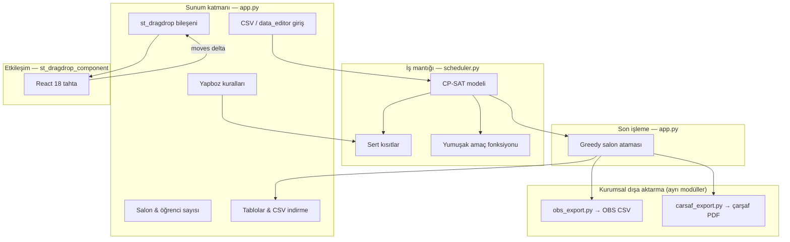
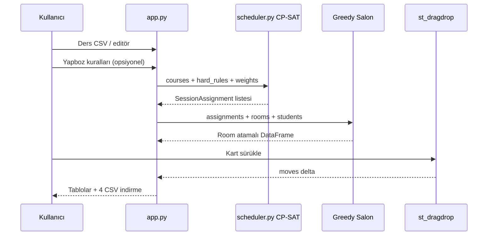

# Üniversite Ders Programı Otomasyon Sistemi (Ders Programı Asistanı)

> **Bu README**, sunum / final raporu / başka bir yapay zekâ aracına verilecek **eksiksiz proje brifingidir**. Kod tabanındaki tüm modüller, kurallar, veri formatları, mimari ve akademik bağlam burada toplanmıştır.

---

## Akademik ve kurumsal bağlam

| Alan | Bilgi |
|------|-------|
| **Resmî proje adı** | Üniversite Ders Programı Otomasyon Sistemi |
| **Uygulama adı (UI)** | Ders Programı Asistanı |
| **Kurum** | ISUBÜ Teknoloji Fakültesi — Bilgisayar Mühendisliği Bölümü |
| **Ders** | Bilgisayar Mühendisliğinde Proje Uygulamaları (Final Raporu) |
| **Öğrenci** | Serdar KORKMAZ — 2312729014 |
| **Danışman** | Prof. Dr. Tuncay AYDOĞAN |
| **GitHub** | https://github.com/hustle342/ISUBUDersProgrami.git |
| **Hedef kullanıcı** | Bölüm sekreterliği, program sorumluları, teknik olmayan idari personel |

### Problem tanımı

Üniversitelerde haftalık ders programı hazırlama; Excel, e-posta ve deneme-yanılma ile yürütülen, hataya açık ve zaman alan bir süreçtir. Literatürde **otomatik çizelgeleme (automated timetabling)** olarak geçen bu problem; öğretmen çakışması, sınıf çakışması, kapasite ve tercih kısıtlarının bir arada çözülmesini gerektiren **kombinatoryal optimizasyon** problemidir.

### Çözüm özeti

Python + Streamlit web arayüzü, Google OR-Tools **CP-SAT** kısıt programlama çözücüsü ve özel **React sürükle-bırak** bileşeni ile:

1. Ders verisinden **çakışmasız** haftalık program üretir.
2. Kullanıcıya **yapboz kuralları** ve **optimizasyon ağırlıkları** ile esneklik verir.
3. Sonucu **liste, haftalık tablo, CSV** ve (ayrı modüllerle) **OBS / çarşaf PDF** formatlarına dönüştürür.
4. **İnsan–makine iş birliği**: sistem taslak üretir, kullanıcı sürükle-bırak ile düzenler, istenirse düzenlemeleri sert kurala çevirip yeniden çözer.

---

## Teknoloji yığını

| Katman | Teknoloji | Sürüm (min.) | Rol |
|--------|-----------|--------------|-----|
| Dil | Python | 3.x | Ana geliştirme dili |
| Web UI | Streamlit | ≥ 1.36 | Arayüz, widget, session state |
| Veri | Pandas | ≥ 2.2 | CSV okuma/yazma, tablolar |
| Optimizasyon | Google OR-Tools (CP-SAT) | ≥ 9.10 | Zaman slotu ataması |
| PDF | ReportLab | ≥ 4.2 | Çarşaf program PDF (carsaf_export) |
| Ön yüz (bileşen) | React 18 | — | Sürükle-bırak tahta |
| Paketleme | Webpack 5, Babel | — | Bileşen derlemesi |
| Köprü | streamlit-component-lib | — | React ↔ Streamlit iletişimi |
| Sürükle-bırak | HTML5 Drag and Drop API | — | Kart taşıma, salon değiştirme |

**requirements.txt:**
```
streamlit>=1.36.0
pandas>=2.2.0
ortools>=9.10.0
reportlab>=4.2.0
```

---

## Proje dosya yapısı

```
DersProgrami/
├── app.py                      # Ana Streamlit uygulaması (~1580 satır)
├── scheduler.py                # CP-SAT çizelgeleme motoru (~256 satır)
├── obs_export.py               # OBS PDF düzenine CSV dışa aktarma (~383 satır)
├── carsaf_export.py            # ISUBÜ çarşaf program PDF (~459 satır)
├── convert_orjinal_form.py     # Excel görevlendirme formu → CSV dönüştürücü
├── debug_log.py                # NDJSON debug logger
├── start_app.bat               # Windows hızlı başlatma (.venv + streamlit)
├── requirements.txt
├── README.md
│
├── st_dragdrop_component/        # Özel Streamlit bileşeni
│   ├── __init__.py             # Python wrapper (declare_component)
│   ├── README.md
│   └── frontend/
│       ├── src/App.js          # React tahta (sürükle-bırak, salon, renkler)
│       ├── package.json
│       ├── webpack.config.js
│       └── build/              # Üretim derlemesi (npm run build)
│
├── sample_data/
│   ├── DERSLER.csv             # Örnek bölüm ders listesi (BLG, MTB, ING…)
│   ├── SALONLAR.csv            # Salon kapasite/tip/ekipman
│   ├── orjinal_dersler.csv     # Excel formundan üretilmiş genişletilmiş ders CSV
│   └── orjinal_salonlar.csv    # Salon kopyası
│
├── scripts/
│   └── fix_blg_dersler.py      # BLG-224/228 A-B lab düzeltme scripti
│
├── test_block_integrity.py     # Blok bütünlüğü testleri
├── test_cohort_carsaf.py       # Çarşaf kohort çakışma testleri
├── test_optimize.py            # Sınıf bazlı optimizasyon testi
├── test_project_health.py      # Uçtan uca sağlık taraması
└── test_puzzle_rules.py        # Yapboz kural testleri
```

**Not:** `section_*.txt` dosyaları final rapor taslağı metinleridir; repoda `.gitignore` ile commit dışı bırakılmış olabilir.

---

## Mimari (üst seviye)



### İki aşamalı çözüm stratejisi

1. **Aşama 1 — Zamanlama (CP-SAT):** Her ders oturumu tam olarak bir `(gün, saat)` slotuna atanır. Öğretmen/sınıf çakışması ve kullanıcı kuralları **sert kısıt** olarak garanti edilir.
2. **Aşama 2 — Salon ataması (greedy):** `assign_rooms_to_schedule()` oturumları `(gün, saat)` dilimine göre gruplar; öğrenci sayısına göre sıralar; kapasiteyi karşılayan **en küçük uygun salonu** seçer. Tam entegre oda-zaman birleşik optimizasyonu **yapılmaz**.

---

## Zaman ızgarası

| Parametre | Değer |
|-----------|-------|
| Günler (`DAYS`) | Pazartesi, Salı, Çarşamba, Perşembe, Cuma |
| Saatler (`HOURS`) | 9, 10, 11, 12, 14, 15, 16 |
| Saat etiketi | `09:00-10:00` … `16:00-17:00` |
| Öğle arası | **13:00–14:00 slot listesinde yok** (otomatik bloklu) |
| Haftalık slot sayısı | 5 gün × 7 saat = **35 slot** |
| Son ders bitişi | En geç **17:00** |

**OBS/çarşaf modülleri** için planlanan genişletilmiş saat dilimleri (scheduler genişletmesinde): `09:25-10:10`, `10:20-11:05`, `11:15-12:00`, `12:10-12:55`, `13:05-13:50`, `14:00-14:45`, `14:55-15:40`, `15:50-16:35` — `TIME_SLOTS`, `HOUR_TO_SLOT_INDEX` sabitleri `obs_export.py` / `carsaf_export.py` tarafından beklenir.

---

## Çizelgeleme motoru (`scheduler.py`)

### Veri modelleri

```python
@dataclass
class Course:
    code: str
    name: str
    teacher: str
    class_name: str
    weekly_hours: int
    department: str = ""

@dataclass
class SessionAssignment:
    course_code: str
    course_name: str
    teacher: str
    class_name: str
    day: str
    hour: int
    department: str = ""
```

### Karar değişkenleri

- `x[sid, ci, slot_i] ∈ {0,1}` — oturum `sid` (ders `ci`'nin `si`. oturumu) slot `slot_i`'de mi?
- Her oturum **tam bir** slota atanır: `Σ slot x = 1`

### Sert kısıtlar (hard constraints)

| # | Kısıt | Matematiksel ifade |
|---|-------|-------------------|
| 1 | Öğretmen çakışması | Aynı slotta bir öğretmene ≤ 1 oturum |
| 2 | Sınıf çakışması | Aynı slotta bir sınıfa ≤ 1 oturum |
| 3 | Haftalık saat | Her dersin `weekly_hours` kadar oturumu |
| 4 | Yapboz kuralları | `require=True` → eşleşen ≥ 1; `require=False` → eşleşen = 0 |
| 5 | Günlük üst sınır | Sınıf başına günde ≤ `max_daily_hours` (varsayılan 6) |
| 6 | Öğretmen yasak slot | `teacher_unavailable_slots` ile belirli (gün, saat) yasak |
| 7 | Öğle arası | `HOURS` listesinde 13 yok |

### Yumuşak kısıtlar (soft — minimize edilir)

| # | Hedef | Açıklama | Varsayılan ağırlık |
|---|-------|----------|-------------------|
| 1 | Öğretmen gün yoğunluğu | Öğretmenin ders gördüğü **gün sayısını** azalt (aynı güne toplama) | 8 |
| 2 | Sınıf gün yoğunluğu | Sınıfın ders gördüğü gün sayısını azalt | 5 |
| 3 | Öğretmen boşluk cezası | Aynı gün iki ders arası boş saat penalize | 4 |
| 4 | Sınıf boşluk cezası | Aynı gün iki ders arası boş saat penalize | 4 |

### Çözücü parametreleri

- `max_time_in_seconds`: kullanıcı slider (2–30 sn, varsayılan 8)
- `num_search_workers = 8`
- Sonuç: `OPTIMAL` → "Optimal çözüm bulundu." / `FEASIBLE` → "Uygun çözüm bulundu." / aksi → hata

### `solve_timetable()` parametreleri

```python
solve_timetable(
    courses,
    weight_teacher_day_compact=8,
    weight_class_day_compact=5,
    weight_teacher_gap=4,
    weight_class_gap=4,
    max_daily_hours=6,
    teacher_unavailable_slots=None,
    hard_rules=None,
    time_limit_seconds=8,
)
```

---

## Ana uygulama (`app.py`) — kullanıcı akışı

### Hızlı kullanım (3 adım — UI rehber kutusu)

1. Ders verisini gir veya CSV yükle.
2. İsteğe bağlı kurallar ve salon bilgilerini ekle.
3. Sürükle-bırak ile düzenle; sonucu listeden kontrol et.

### Detaylı adımlar (7 bölüm)

#### Adım 1 — Ders verisi

- CSV yükleme veya `st.data_editor` ile satır ekleme/silme
- Zorunlu sütunlar: `code`, `name`, `teacher`, `class`, `weekly_hours`
- Opsiyonel: `department`, `enrolled`, `group` (→ `class` olarak eşlenir)
- Çoklu kodlama: `utf-8`, `cp1254`, `latin1` (`safe_read_csv`)
- Departman filtresi (sidebar multiselect)

#### Adım 2 — Yapboz kural oluşturucu

Parçalar birleştirilerek kural oluşturulur:

| Parça | Anahtar | Etiket |
|-------|---------|--------|
| Öğretmen | `teacher` | Öğretmen |
| Gün | `day` | Gün |
| Saat | `hour` | Saat |
| Ders | `course` | Ders |
| Sınıf | `class` | Sınıf |

- Kural tipi: **olsun** (`require=True`) veya **olmasın** (`require=False`)
- Kurallar `st.session_state.puzzle_rules` içinde saklanır → `hard_rules` listesine derlenir

#### Adım 3 — Sınıf ve salon bilgileri

- **Sınıf bilgisi:** `class_name`, `students`, `mandatory_attendance`
- **Salon CSV:** `room`, `capacity` (+ opsiyonel `type`, `equipment`)
- Kapasite toleransı slider: %0–100 (`over_percent`)
- "Kapasite kontrolünü sadece devam zorunluluğu olan öğrenciler üzerinden yap" checkbox
- Listeleme gruplama: Hoca / Ders / Sınıf / Salon

#### Optimizasyon ayarları (sidebar)

| Ayar | Aralık | Varsayılan |
|------|--------|------------|
| Hoca — aynı güne toplama | 1–20 | 8 |
| Sınıf — aynı güne toplama | 1–20 | 5 |
| Boşluk cezası (hoca + sınıf) | 0–20 | 4 |
| Günlük max saat (sınıf) | 2–8 | 6 |
| Çözüm süresi (sn) | 2–30 | 8 |

#### Özel durum: "Hoca havuzu" ayrıştırması

Aynı öğretmen adıyla birden fazla sınıfa atanmış ve toplam haftalık saat > 35 slot olan kayıtlar için çözücüye iç etiket gönderilir:

```
internal_teacher = f"{teacher_label} || {course.class_name}"
```

Böylece "Yabancı Diller Yüksekokulu", "Fizik Bölümü" gibi havuz etiketleri yapay çakışma üretmez. UI'da hoca adı `split(" || ")[0]` ile gösterilir.

#### Adım 4 — Program düzenleme

**Yöntem A — Gerçek sürükle-bırak (önerilen):** `st_dragdrop_component`

- React 18 + HTML5 DnD
- Sınıfa göre renkli kartlar (12 renk paleti)
- Gün × saat ızgarası, kaydırılabilir alan (height=700)
- Sunucu tarafı çakışma kontrolü (hoca/sınıf)
- Salon etiketini kartlar arası sürükleyerek değiştirme
- Yalnızca değişen kartlar Python'a iletilir (delta)

**Yöntem B — Manuel taşı:** multiselect → hedef gün/saat → çakışma uyarısı / zorla taşı

**Yöntem C — Güvenli taşıma (Streamlit):** hücre seç → hedef seç → Kaydet/İptal

**Ortak özellikler:**

- Geri al (`move_history` yığını)
- Sıfırla (onay kutusu → `assignments_orig`)
- Preserved moves → sert kurala çevirip yeniden CP-SAT çözümü
- Filtreler: hoca, sınıf, ders, departman

#### Adım 5–7 — Sonuç görünümleri

| Bölüm | İçerik |
|-------|--------|
| 5 — Detaylı liste | Gün, Saat, Kod, Ders, Hoca, Sınıf, Room, students, room_capacity, room_ok, over_by |
| 6 — Gruplu liste | Hoca/Ders/Sınıf/Salon expander'ları |
| 7 — Haftalık program | Pivot tablo (satır=saat, sütun=gün) |

#### İndirilebilir CSV'ler (4 adet)

| Dosya | İçerik |
|-------|--------|
| `program_detayli.csv` | Tüm sütunlar |
| `program_haftalik_tablo.csv` | Pivot görünüm |
| `program_hoca_bazli.csv` | Hocaya göre sıralı |
| `program_sinif_bazli.csv` | Sınıfa göre sıralı |

- Ayırıcı: **noktalı virgül (`;`)**
- Kodlama: **UTF-8 BOM** (Türkçe Excel uyumu)

### Salon ataması (`assign_rooms_to_schedule`)

Greedy algoritma:

1. Oturumları `(gün, saat)` dilimine göre grupla
2. Öğrenci sayısına göre büyükten küçüğe sırala
3. Manuel seçilmiş salon varsa öncelik ver
4. Kapasiteyi karşılayan **en küçük** boş salonu seç
5. Uygun salon yoksa en büyük boş salon + `over_by` işaretle
6. Hiç salon kalmadıysa `Room=None`, `room_ok=False`

Öğrenci sayısı önceliği: `mandatory_attendance` → `enrolled_map` (ders CSV) → `class_info.students`

---

## Session state anahtarları

| Anahtar | Anlam |
|---------|-------|
| `puzzle_rules` | Aktif yapboz kuralları listesi |
| `builder_pieces` | Kural oluşturucuda seçili parçalar |
| `assignments_orig` | CP-SAT çözücüsünün ürettiği orijinal atamalar |
| `assignments_mod` | Kalıcı manuel düzenlemeler |
| `assignments_staged` | Sürükle-bırak önizleme kopyası |
| `preserved_moves` | `(course_code, class_name)` → `{day, hour, room}` |
| `move_history` | Geri al için önceki konum yığını |
| `cell_pending_changes` | Güvenli taşıma bekleyen değişiklikler |
| `dept_selected` | Departman filtresi |
| `filter_teachers/classes/courses/depts` | Sonuç filtreleri |

---

## Özel Streamlit bileşeni (`st_dragdrop_component`)

### Python API

```python
from st_dragdrop_component import st_dragdrop

moves = st_dragdrop(
    assignments,   # [{id, course_code, course_name, teacher, class_name, day, hour, room}, ...]
    DAYS,
    HOURS,
    room_options,
    class_options,
    height=700,
    key="dragdrop_component_main",
)
# moves: [{"id": 3, "day": "Salı", "hour": 10, "room": "403 NOLU LAB"}, ...]
```

### React özellikleri (`App.js`)

- Sınıf bazlı 12 renkli kart paleti
- HTML5 drag-and-drop ile gün/saat hücresine taşıma
- Salon etiketini başka karta sürükleyerek salon değiştirme
- `changedIdsRef` ile delta senkronizasyonu
- `teacherBase()`: `||` iç etiketini UI'da gizler

### Geliştirme ve derleme

```bash
cd st_dragdrop_component/frontend
npm install
npm run start    # dev: http://localhost:3001
npm run build    # üretim: frontend/build/
```

Üretimde `frontend/build/` mevcutsa dev sunucu gerekmez.

---

## Veri formatları

### Ders CSV (zorunlu sütunlar)

| Sütun | Tip | Açıklama |
|-------|-----|----------|
| `code` | string | Ders kodu (ör. BLG-102) |
| `name` | string | Ders adı |
| `teacher` | string | Öğretim elemanı (ünvanlı tam ad) |
| `class` | string | Sınıf etiketi (ör. 1.Sınıf, 2.Sınıf-A) |
| `weekly_hours` | number | Haftalık teorik saat (yuvarlanır) |

**Opsiyonel sütunlar:** `department`, `enrolled`, `course_type`, `lab_hours`, `tur`

### Salon CSV

| Sütun | Açıklama |
|-------|----------|
| `room` | Salon adı (ör. 414 NOLU DERSLİK) |
| `capacity` | Kapasite |
| `type` | Derslik / Lab / Amfi |
| `equipment` | Projeksiyon, Bilgisayar vb. |

### Örnek veri setleri

- `sample_data/DERSLER.csv` — 24+ ders, BLG/MTB/ING kodları, gerçekçi ISUBÜ senaryosu
- `sample_data/orjinal_dersler.csv` — Excel formundan üretilmiş; lab satırları (`-LAB`), seçimlikler, A/B grupları
- `sample_data/SALONLAR.csv` — 10 salon (80–120 kapasite, lab, amfi)

### Excel → CSV dönüştürücü (`convert_orjinal_form.py`)

Kaynak: `BİLGİSAYAR DERS GÖREVLENDİRME FORM 70 bahar.xlsx` (sample_data içinde)

- Yarıyıl başlıklarından sınıf çıkarımı (I–VIII. Yarıyıl → 1.–4. Sınıf)
- Lab dersleri ayrı satır (`CODE-LAB`, sabit lab hocası: Arş. Gör. Hüseyin Furkan ZENGİN)
- Seçimlik (`tur=S`) ve ÜOS seçmeli desteği
- A/B grup ayrımı (`2.Sınıf-A`, `2.Sınıf-B`)
- Çıktı: `orjinal_dersler.csv` + `orjinal_salonlar.csv`

```bash
python convert_orjinal_form.py
```

---

## Kurumsal dışa aktarma modülleri

### OBS dışa aktarma (`obs_export.py`)

**Amaç:** Üniversite OBS ders programı PDF düzenine uygun CSV üretmek.

**OBS sütunları:** `SINIF`, `ŞUBE`, `DERS ADI`, her gün için `BAŞ SAATİ` / `BİT SAATİ`, `BİNA`, `DERSLİK`, `TKr`, `TSa`, `ÖĞR. ÜYE`

**Ana fonksiyonlar:**

| Fonksiyon | Görev |
|-----------|-------|
| `build_obs_export_df()` | Program satırlarından OBS tablosu |
| `build_obs_export_for_button()` | detail / weekly / teacher / class modları |
| `obs_export_to_csv_bytes()` | UTF-8 BOM CSV bytes |
| `parse_class_section()` | `1.Sınıf-A` → sinif + şube |
| `format_derslik()` | Lab/Amfi formatlama |
| `merge_hour_blocks()` | Ardışık saatleri birleştir |

**Modlar:** `detail`, `weekly`, `teacher`, `class`

### Çarşaf program PDF (`carsaf_export.py`)

**Amaç:** ISUBÜ Teknoloji Fakültesi Bilgisayar Müh. bölüm **master grid** çarşaf program PDF'i.

- Sayfa: A2 yatay, tek sayfa genişlik
- 4 sınıf × A/B şube sütunları
- Zorunlu dersler siyah/kırmızı (A/B), seçmeliler mavi italik
- ReportLab Table + Paragraph, Arial/DejaVu font
- Varsayılan başlık: *"ISUBÜ TEKNOLOJİ FAKÜLTESİ BİLGİSAYAR MÜHENDİSLİĞİ BÖLÜMÜ 2025-2026 EĞİTİM ÖĞRETİM YILI GÜZ DÖNEMİ DERS PROGRAMI"*
- Çıktı dosya adı: `çarşaf program.pdf`

**Ana fonksiyon:** `build_carsaf_pdf_bytes(schedule_df, courses_df, title=...)`

### Entegrasyon notu (önemli)

`obs_export.py` ve `carsaf_export.py`, `scheduler.py` içinde şu sabitleri/fonksiyonları **bekler**:

`TIME_SLOTS`, `HOUR_TO_SLOT_INDEX`, `SLOT_INDEX_TO_HOUR`, `format_slot_label`, `format_hour_slot`, `parse_hour_from_saat_label`, `carsaf_include_class`, `row_is_elective`, `is_elective_course`, `overloaded_classes`

Mevcut `scheduler.py` (256 satır) bu genişletmeleri **henüz içermiyor**; bu modüller ayrı geliştirilmiş ve test dosyaları (`test_project_health.py`, `test_cohort_carsaf.py`) tam API'yi referans alıyor. **Ana Streamlit uygulaması (`app.py`) şu an bu export modüllerini çağırmıyor** — CSV indirme uygulama içinden yapılıyor.

---

## Test dosyaları

| Dosya | Ne test eder |
|-------|--------------|
| `test_project_health.py` | Import, CSV yükleme, solver, OBS/çarşaf export — sonuçlar `debug-876524.log` |
| `test_cohort_carsaf.py` | Çarşaf kohort çakışma analizi |
| `test_block_integrity.py` | Ardışık saat blok bütünlüğü |
| `test_optimize.py` | Tek sınıf optimizasyon senaryosu |
| `test_puzzle_rules.py` | Yapboz kural çözülebilirliği |

```bash
python test_project_health.py
python -m pytest test_*.py   # pytest kuruluysa
```

---

## Kurulum ve çalıştırma

### Windows (önerilen)

```bash
python -m venv .venv
.venv\Scripts\activate
pip install -r requirements.txt
python -m streamlit run app.py
```

Veya: `start_app.bat` (otomatik `.venv` aktivasyonu)

Tarayıcı: genelde `http://localhost:8501`

### Linux / macOS

```bash
python3 -m venv .venv
source .venv/bin/activate
pip install -r requirements.txt
streamlit run app.py
```

---

## Proje kapsamı ve sınırlamalar

### Kapsam içi

- Hafta içi sabit saat ızgarası
- Öğretmen/sınıf çakışma önleme
- Yapboz kuralları ve optimizasyon ağırlıkları
- Greedy salon ataması ve kapasite raporu
- Sürükle-bırak + manuel düzenleme + geri al
- CSV giriş/çıkış (Türkçe Excel uyumlu)
- OBS/çarşaf export modülleri (ayrı Python modülleri)

### Kapsam dışı / sınırlar

| Sınır | Açıklama |
|-------|----------|
| Sabit takvim | Farklı fakülte saat şablonları için yapılandırma UI yok |
| Salon optimizasyonu | Zaman ve salon ayrı aşamada; birleşik optimum garanti değil |
| Tek kullanıcı | Merkezi veritabanı, rol tabanlı erişim, çok kullanıcılı onay yok |
| Sınav/staj modülü | Ayrı sınav programı tanımlı değil |
| Üretim dağıtımı | Yerel Streamlit; kurumsal API/mobil istemci yok |
| Büyük veri | Çözüm süresi sınırlı; optimal yerine feasible çözüm olabilir |

---

## Literatür ve akademik referanslar

Proje final raporunda atıf yapılan kaynaklar:

1. Google OR-Tools — https://developers.google.com/optimization
2. CP-SAT Solver — https://developers.google.com/optimization/cp/cp_solver
3. OR-Tools GitHub — https://github.com/google/or-tools
4. Streamlit Docs — https://docs.streamlit.io/
5. Streamlit Custom Components — https://docs.streamlit.io/develop/concepts/custom-components/intro
6. Pandas — https://pandas.pydata.org/docs/
7. Python 3 Docs — https://docs.python.org/3/
8. React — https://react.dev/
9. Schaerf, A. (1999). A survey of automated timetabling. *Artificial Intelligence Review*.
10. Burke & Petrovic (2002). Recent research directions in automated timetabling. *EJOR*.
11. de Werra (1985). An introduction to timetabling. *EJOR*.
12. Rossi, van Beek, Walsh (2006). *Handbook of Constraint Programming*.
13. Apt (2003). *Principles of Constraint Programming*.
14. HTML Drag and Drop API — MDN
15. McKinney (2017). *Python for Data Analysis* (Pandas)

---

## Sunum için önerilen slayt başlıkları

1. Problem: Manuel ders programı hazırlamanın zorlukları
2. Çözüm mimarisi: Streamlit + CP-SAT + React bileşen
3. Demo akışı: 3 adımda program oluşturma
4. Sert vs yumuşak kurallar (tablo + örnek)
5. CP-SAT modeli (karar değişkenleri, kısıtlar)
6. İki aşamalı çözüm: zamanlama + salon ataması
7. Yapboz kural oluşturucu (ekran görüntüsü)
8. Sürükle-bırak tahta (React bileşen)
9. Sonuç görünümleri: detaylı / gruplu / haftalık
10. ISUBÜ gerçek veri: DERSLER.csv, SALONLAR.csv
11. OBS ve çarşaf PDF dışa aktarma
12. Test ve doğrulama
13. Sınırlamalar ve gelecek işler
14. Sonuç ve kazanımlar

---

## İş akışı diyagramı (sunum)



---

## Geliştirici notları

- `debug_log.py` → NDJSON log (`debug-876524.log`), test ve debug oturumları için
- `scripts/fix_blg_dersler.py` → BLG-224/228 ortak teorik + A/B lab ayrımı CSV düzeltmesi
- `.gitignore` → `__pycache__`, `node_modules`, PDF/XLSX, geçici rapor dosyaları hariç
- `st_dragdrop_component/frontend/node_modules` repoda takip edilmez; `npm install` ile kurulur

---

## Özet cümle (elevator pitch)

**Ders Programı Asistanı**, ISUBÜ Bilgisayar Mühendisliği için geliştirilmiş, CP-SAT tabanlı otomatik çizelgeleme ve React sürükle-bırak düzenleme sunan bir Streamlit uygulamasıdır; öğretmen/sınıf çakışmalarını garanti altına alır, kullanıcı kurallarını ve manuel müdahaleleri destekler, sonucu kurumsal CSV/PDF formatlarına dönüştürmeye hazır modüllerle tamamlar.
